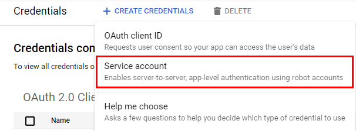
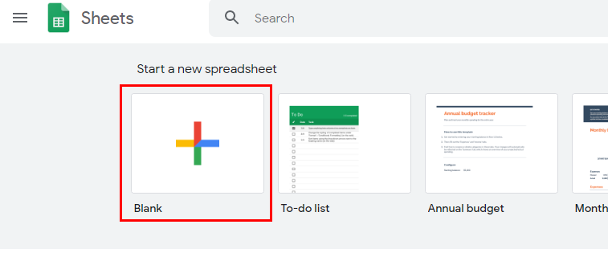
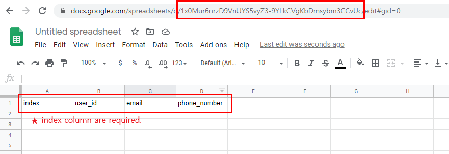
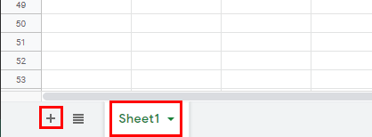

<p align="center">
  <a href="" rel="noopener">
 </a>
 <br>

 
</p>

<h3 align="center">Spreadsheet DB</h3>

<div align="center">

[]()
[](https://github.com/da-huin/spreadsheet_db/issues)
[](https://github.com/da-huin/spreadsheet_db/pulls)
[](/LICENSE)

</div>

---

<p align="center"> This package helps you use Spreadsheet as DB in python.
    <br> 
</p>

## 📝 Table of Contents

- [About](#about)
- [Getting Started](#getting_started)
- [Usage](#usage)
- [Acknowledgments](#acknowledgement)

## 🧐 About <a name = "about"></a>

This package helps you use Spreadsheet as DB for developers. You can use following functions (CRUD).

* [SELECT](#select)
* [INSERT](#insert)
* [UPDATE](#update)
* [UPSERT](#upsert)
* [DELETE](#delete)

## 🏁 Getting Started <a name = "getting_started"></a>

### Installing

```
pip install spreadsheet_db
```

<a name="prerequisites"></a>

### Prerequisites 

<a name="auth_json"></a>


#### 🌱 (Required) Download Spreadsheet Authentication JSON

1. From [Google Cloud Platform Console](https://console.developers.google.com/project), `create project`, if you already have a project, you can omit it.

    


1. Enable [Google Drive API](https://developers.google.com/drive/api/v3/enable-drive-api), if is not already enabled.

    

1. Enable [Google Sheet API](https://console.developers.google.com/apis/api/sheets.googleapis.com/overview), if is not already enabled.

    

1. From [Google Credential](https://console.developers.google.com/apis/api/iamcredentials.googleapis.com/credentials) choose `Create credentials` > `Service Account`.

    

1. Fill out the form and click `Create Key`. 
    
    
    
    

1. Click the `account you just created`, from the `Service Accounts`.

    

1. click the `ADD KEY` > `Create new key`

    

1. Set the `Key type` to JSON and click `CREATE` button

    

1. The JSON file automatically saved, which is used to authenticate the spreadsheet.

    


#### 🌱 (Required) Creating an Instance

`Authentication JSON` is required to create an `instance`. If you have not downloaded the `Authentication JSON`, refer to [here](#auth_json).

1. Create new [Spreadsheet](https://docs.google.com/spreadsheets/u/0/).

    
    

1. Add `Column Names` and remember `Spreadsheet ID`.

    * `index column` are required!

    

1. Change `Sheet1` to the name you want to use. in this package, uses `Sheet` as `Table`. if you want, create a new table.

    

1. Click [HERE]([https://console.developers.google.com/apis/api/iamcredentials.googleapis.com/credentials]) to add `spreadsheet authentication`.

1. Copy the e-mail of the authentication you created ealier.

    

1. Comeback Spreadsheet and press `Share` button.

    

1. Paste `copied email` and press `Enter Key`.

    

1. Click the `Send` button

    

1. Create an instance using an code below.

    ```python

    import spreadsheet_db
    import json

    with open("your_auth_json_file_name.json") as fp:
        auth_json = json.loads(fp.read())

    sheet_id = "Your Spreadsheet ID"
    sheet_name= "Your Sheet Name"

    # INPUT a list of column names to give the UNIQUE option. Duplicate values are not entered for the UNIQUE column.
    unique_columns = ["column_name_to_give_the_UNIQUE_option"]

    sdb = spreadsheet_db.SpreadSheetDB(
        auth_json, sheet_id, sheet_name, unique_columns=unique_columns)

    print(sdb)
    ```
    
    result
    ```
    <spreadsheet_db.SpreadSheetDB object at 0x009EE820>
    ```

1. From now on, you can use the spreadsheet as a DB 🎉

## 🎈 Usage <a name="usage"></a>

Please check [Prerequisites](#prerequisites) before starting `Usage`.

### 🌱 INSERT <a name="insert"></a>

Use this function to insert data into the table.

**Parameters**

* `(required) data`: dict

    the dict key is column name and the dict value is value. use like this.

    ```
    { "name": "Lee" }
    ```

**Examples**

* This code insert data to the table.

    ```
    >>> print(sdb.insert({"name": "Park", "phone_number": "01022223333", "email": "Park@google.com"}))
    5
    ```

**Returns**

* Index of inserted data: `int`

### 🌱 SELECT <a name="select"></a>
    
Use this function to get data from a table.

**Parameters**

* `(required) condition`: pandas.core.frame.DataFrame

    You can use pandas dataframe indexing like this (sdb is an instnace of this class.):

    if you want detail, refer to [here](https://pandas.pydata.org/pandas-docs/stable/user_guide/indexing.html).

    ```
    sdb.table["name"] == "Park"
    ```

* `columns`: list (default: [])

    If you want to select all columns, leave it blank.

* `orient`: str (default: "records")

    Between `records` or `list`, You can select the shape of the output value.

**Examples**

1. example 1
    ```
    >>> print(sdb.select(sdb.table["name"].isin(["Park", "Lee"]), ["name", "email"]))
    [{'name': 'Park', 'email': 'Park@google.com'}, {'name': 'Lee', 'email': 'Lee@google.com'}]
    ```

1. example 2

    ```
    >>> print(sdb.select(sdb.table["name"] == "Park"))
    [{'index': '34', 'name': 'Park', 'phone_number': '01022223333', 'email': 'Park@google.com'}]
    ```

1. example 3

    ```
    >>> print(sdb.select(orient="list"))
    {'index': ['34', '35', '36'], 'name': ['Park', 'Lee', 'Han'], 'phone_number': ['01022223333', '01055556666', '01077778888'], 'email': ['Park@google.com', 'Lee@google.com', 'Han@google.com']}
    ```

**Returns**

* Result of SELECT: `dict` or `str`

### 🌱 UPDATE <a name="update"></a>

Use this function to update table.

**Parameters**

* `(required) condition`: pandas.core.frame.DataFrame

    You can use pandas dataframe indexing like this (sdb is an instnace of this class.):

    if you want detail, refer to [here](https://pandas.pydata.org/pandas-docs/stable/user_guide/indexing.html).

    ```
    sdb.table["name"] == "Park"
    ```

* `(required) data`: dict

    the dict key is column name and the dict value is value. use like this.

    ```
    { "name": "Lee" }
    ```

**Examples**

* This code finds the rows where the `name` column is `Park` and replace `name` with `Lee`.

    ```
    >>> sdb.update(sdb.table["name"] == "Park", { "name" : "Lee" })
    index name        phone            email
    0    34  Lee  01022223333  Park@google.com    
    ```

**Returns**

* Selected Rows through condition: `dict` or `str`

### 🌱 UPSERT <a name="upsert"></a>

Use this function to upsert table. Update if condition exists else insert data.

**Parameters**

* `(required) condition`: pandas.core.frame.DataFrame
    You can use pandas dataframe indexing like this (sdb is an instnace of this class.):

    if you want detail, refer to [here](https://pandas.pydata.org/pandas-docs/stable/user_guide/indexing.html).

    ```
    sdb.table["name"] == "Park"
    ```

* `(required) data`: dict
    the dict key is column name and the dict value is value. use like this.

    ```
    { "name": "Lee" }        
    ```

**Examples**

* This code finds the rows where the `name` column is `Park`, replace `name` with `Lee` if condition exists else insert data.

    ```
    >>> sdb.upsert(sdb.table["name"] == "Park", { "name" : "Lee" })
    ```

    result when updated:
    ```
    index name        phone            email
    0    34  Lee  01022223333  Park@google.com
    ```
    result when inserted:
    ```
    7
    ```

**Returns**

* Return when updated: Selected Rows through condition: `dict` or `str`
* Return when inserted: Index of inserted data: `int`

### 🌱 DELETE <a name="delete"></a>

Use this function to delete rows from the table.

**Parameters**

* `(required) condition`: pandas.core.frame.DataFrame

    You can use pandas dataframe indexing like this (sdb is an instnace of this class.):
    
    if you want detail, refer to [here](https://pandas.pydata.org/pandas-docs/stable/user_guide/indexing.html).

    ```
    sdb.table["name"] == "Park"
    ```

**Examples**

* This code finds the rows where the `name` column is `Park` and deletes the rows.

    ```
    >>> sdb.delete(sdb.table["name"] == "Park")
    [0, 3]
    ```

**Returns**

* drop indexes: `list`


## 🎉 Acknowledgements <a name = "acknowledgement"></a>

- Title icon made by [Freepik](https://www.flaticon.com/kr/authors/freepik).

- If you have a problem. please make [issue](https://github.com/da-huin/spreadsheet_db/issues).

- Please help develop this project 😀

- Thanks for reading 😄
